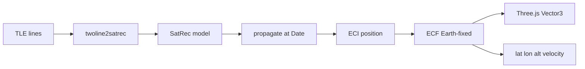
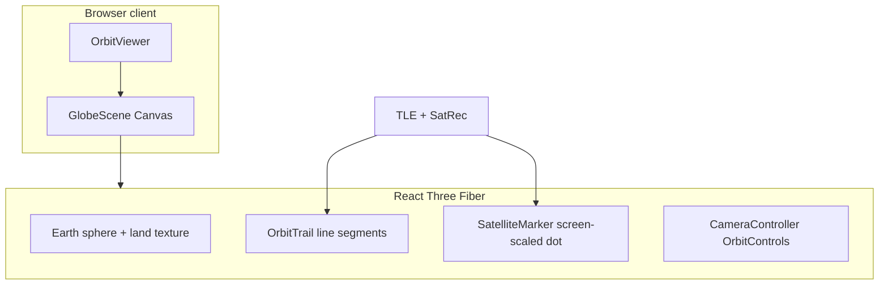

# Orbit

A minimal 3D satellite tracker for Thailand spacecraft, built by [SpaceTH](https://spaceth.co). Orbit downloads live **TLE** (Two-Line Element) data, propagates each orbit with **SGP4**, and renders positions on an interactive Earth globe in the browser.

Browse eight Thailand satellites at once, select any spacecraft to inspect live telemetry, hide individual dots and trails, and switch between light and dark mode.

## Features

- **Multi-satellite tracking** — eight Thailand spacecraft in a single view ([`src/data/satellites.ts`](src/data/satellites.ts))
- **Live TLE data** — fetched through a server-side proxy with a 1-hour cache ([`src/app/api/tle/[id]/route.ts`](src/app/api/tle/[id]/route.ts))
- **Graceful partial loading** — satellites without TLE data appear as "Unavailable" instead of blocking the whole app ([`src/hooks/use-satellites.ts`](src/hooks/use-satellites.ts))
- **SGP4 propagation** — real-time position, velocity, and orbit trails ([`src/lib/orbit.ts`](src/lib/orbit.ts))
- **3D globe** — Natural Earth land mask rasterized to a high-resolution equirectangular texture ([`src/lib/geo.ts`](src/lib/geo.ts))
- **Orbit trails** — past orbit through the present; geostationary satellites render as equatorial rings ([`src/components/globe/orbit-trail.tsx`](src/components/globe/orbit-trail.tsx))
- **Screen-space markers** — 3px dots (7px when selected), constant size at any zoom ([`src/lib/screen-scale.ts`](src/lib/screen-scale.ts))
- **Per-satellite visibility** — eye icon toggles dot and trail on/off ([`src/components/visibility-icon.tsx`](src/components/visibility-icon.tsx))
- **Camera focus** — smooth centering on select, return to Earth on deselect ([`src/components/globe/camera-controller.tsx`](src/components/globe/camera-controller.tsx))
- **Light / dark mode** — theme tokens shared between UI and WebGL scene ([`src/app/globals.css`](src/app/globals.css))
- **Satellite metadata** — purpose, launch date, description, and more in the detail panel ([`src/types/satellite.ts`](src/types/satellite.ts))

## What is TLE?

A **Two-Line Element set (TLE)** is a compact text format that describes a satellite's orbit at a specific moment in time (the *epoch*). Space surveillance networks such as NORAD publish TLEs for tracked objects. They are updated periodically as orbits drift or are corrected by maneuvers.

A TLE has three parts: a name line and two data lines. The data lines encode orbital elements — inclination, eccentricity, mean motion, right ascension, and so on — in a fixed-width format.

```
ISS (ZARYA)
1 25544U 98067A   24001.50000000  .00016717  00000-0  10270-3 0  9993
2 25544  51.6400 208.9163 0006703  69.9862  25.7386 15.49519778412345
```

Orbit does **not** store satellite positions. It downloads a TLE, then uses an orbit model to *propagate* that snapshot forward and backward in time to answer: where is this satellite right now?

## How propagation works (SGP4)

Orbit uses [satellite.js](https://github.com/shashwatak/satellite-js) v5, which implements the **SGP4** (and SDP4) propagator — the standard algorithm for near-Earth and deep-space TLEs.



| Step | Function | Output |
|------|----------|--------|
| Parse TLE | `parseTle()` in [`src/lib/orbit.ts`](src/lib/orbit.ts) | `SatRec` orbit model |
| Position on globe | `getEcfPosition()` | `Vector3` in scene units (Earth radius = 1, 6371 km) |
| Panel readout | `getTelemetry()` | latitude, longitude, altitude, velocity |
| Orbit trail | `sampleOrbitTrail()` | 180 points from one orbit in the past to now |

Geostationary satellites are detected automatically and their trails are rendered as full equatorial rings, re-aligned each frame to the current position.

## API

Orbit exposes a single internal route that proxies TLE requests. It is **not** intended as a public API for third-party use — an allowlist restricts which NORAD IDs can be fetched.

### `GET /api/tle/[id]`

| | |
|---|---|
| **Parameter** | `id` — NORAD catalog number (integer) |
| **200** | `{ noradId, name, line1, line2, date }` |
| **403** | Satellite not in the allowlist |
| **503** | Upstream TLE fetch failed |

**Upstream source:** [tle.ivanstanojevic.me](https://tle.ivanstanojevic.me)

**Allowlist:** only NORAD IDs listed in [`src/data/satellites.ts`](src/data/satellites.ts), enforced by `isAllowedNoradId()` in [`src/lib/satellites.ts`](src/lib/satellites.ts). This prevents the route from being used as an open proxy.

**Cache:** responses are cached for 1 hour (`revalidate: 3600`).

```bash
curl http://localhost:3000/api/tle/67683
```

Example response:

```json
{
  "noradId": 67683,
  "name": "KNACKSAT-2",
  "line1": "1 67683U ...",
  "line2": "2 67683 ...",
  "date": "2025-01-15T12:00:00+00:00"
}
```

## Three.js and the globe

The 3D scene is built with **Three.js**, rendered through **React Three Fiber** (R3F) — a React renderer that maps JSX to Three.js objects. The globe is loaded client-side only (`ssr: false`) because WebGL is not available during server rendering.



### Earth

A unit sphere with a land mask texture built at runtime from [Natural Earth](https://www.naturalearthdata.com/) 110m country GeoJSON ([`public/data/countries-110m.json`](public/data/countries-110m.json)). The GeoJSON is rasterized to an 8192×4096 equirectangular canvas in [`buildLandMapTexture()`](src/lib/geo.ts). Ocean and land colors come from CSS theme variables and rebuild when the theme changes.

### Satellite markers

Each satellite is a small sphere whose world-space scale is recalculated every frame so it always appears as **3px** on screen ( **7px** when selected), regardless of camera zoom. A glow halo appears only on the selected satellite.

### Orbit trails

Trails are drawn as 14 line segments with increasing opacity toward the satellite's current position. The trail endpoint is synced to the marker every frame. Geostationary orbits use thinner lines and form complete rings.

### Camera

[`CameraController`](src/components/globe/camera-controller.tsx) wraps drei's `OrbitControls`. Selecting a satellite smoothly animates the camera to center on its dot; deselecting returns to an Earth-centered view. Zoom and rotation remain available while a satellite is selected.

### Theme in WebGL

CSS variables in [`globals.css`](src/app/globals.css) define colors for both the UI and the canvas. [`useThemeColors`](src/hooks/use-theme-colors.ts) reads these variables and passes them into the globe — background, markers, trails, and Earth land/ocean all respond to light and dark mode.

## How the app works (end to end)

1. The client loads and fetches TLE data for every satellite in the registry in parallel.
2. Each TLE is parsed into a `SatRec` model; the globe renders all visible satellites as dots and trails.
3. Clicking a satellite (on the globe or in the panel) selects it — the camera animates to center on the dot and the panel shows metadata plus live telemetry.
4. The eye icon on any row hides that satellite's dot and trail without removing it from the list.
5. Clicking the globe or empty space deselects the current satellite and the camera returns to Earth.

## Getting started

```bash
npm install
npm run dev
```

Open [http://localhost:3000](http://localhost:3000).

| Command | Description |
|---------|-------------|
| `npm run dev` | Start development server |
| `npm run build` | Production build |
| `npm run start` | Start production server |
| `npm run lint` | Run ESLint |

## Adding or removing a satellite

Edit [`src/data/satellites.ts`](src/data/satellites.ts). The API allowlist and UI update automatically — no other files need to change.

```ts
{
  noradId: 12345,
  name: "YOUR-SAT",
  purpose: "Earth Observation",
  description: "Optional short description.",
  launchDate: "2026-01-01",
  operator: "Optional operator name",
}
```

**Required fields:** `noradId`, `name`, `purpose`

**Purpose values:** `"Communication"` | `"Military"` | `"Education"` | `"Earth Observation"`

**Optional fields:** `description`, `launchDate`, `operator`, `manufacturer`

To remove a satellite, delete its entry from the array.

## Tracked satellites

| Name | NORAD ID | Purpose |
|------|----------|---------|
| THEOS-2 | 58016 | Earth Observation |
| KnackSat-2 | 67683 | Education |
| THEOS | 33396 | Earth Observation |
| Thaicom 4 | 28786 | Communication |
| Thaicom 6 | 39500 | Communication |
| Thaicom 7 | 40141 | Communication |
| Thaicom 8 | 41552 | Communication |
| Napa-2 | 48963 | Military |

## Tech stack

- [Next.js](https://nextjs.org/) 16 (App Router, TypeScript)
- [React](https://react.dev/) 19
- [Three.js](https://threejs.org/) + [@react-three/fiber](https://docs.pmnd.rs/react-three-fiber) + [@react-three/drei](https://github.com/pmndrs/drei)
- [satellite.js](https://github.com/shashwatak/satellite-js) v5 — SGP4 propagation
- [Tailwind CSS](https://tailwindcss.com/) v4
- [next-themes](https://github.com/pacocoursey/next-themes) — light / dark mode
- Aktiv Grotesk Thai (Adobe Fonts)

## Project structure

```
src/
├── app/
│   ├── api/tle/[id]/       # TLE proxy route
│   ├── globals.css         # Theme tokens (light + dark)
│   ├── layout.tsx
│   └── page.tsx
├── components/
│   ├── globe/              # Earth, trails, markers, camera
│   ├── orbit-viewer.tsx    # Main client shell
│   ├── satellite-panel.tsx # Sidebar list + telemetry
│   ├── theme-provider.tsx
│   ├── theme-toggle.tsx
│   └── visibility-icon.tsx
├── data/
│   └── satellites.ts       # Satellite registry (source of truth)
├── hooks/
│   ├── use-satellites.ts   # TLE loading, selection, visibility
│   └── use-theme-colors.ts # CSS vars → WebGL colors
├── lib/
│   ├── geo.ts              # Land mask texture builder
│   ├── orbit.ts            # SGP4 propagation helpers
│   ├── satellites.ts       # Registry helpers + allowlist
│   ├── screen-scale.ts     # Pixel → world unit scaling
│   ├── theme.ts            # Theme color types
│   └── tle.ts              # Upstream TLE fetch
└── types/
    └── satellite.ts        # Shared TypeScript types
```

## Credits

- TLE data via [tle.ivanstanojevic.me](https://tle.ivanstanojevic.me)
- Orbit propagation via [satellite.js](https://github.com/shashwatak/satellite-js)
- Country boundaries via [Natural Earth](https://www.naturalearthdata.com/)

## License

Private — SpaceTH
